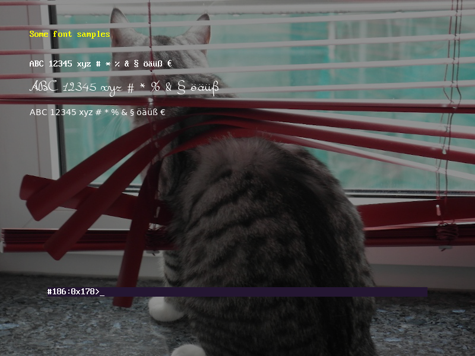

= gfxboot2

A graphical interface to bootloaders.

__This is still in a very early stage.__

It's essentially a rework of https://github.com/openSUSE/gfxboot[gfxboot]
but written in C.

The implemented scripting language is again a
https://en.wikipedia.org/wiki/Stack-oriented_programming[stack-based language] - similar
to what gfxboot uses but with integrated memory management and a hash data type.

=== Status

__The code is not yet ready to be used.__

The scripting language is basically implemented, including the graphics primitves.

The connection to `grub` is still a bit awkward. The patches extend grub to
expose a link to the graphics framebuffer.

This is not strictly needed. gfxboot does never read the video memory.
An`update` function that can update a rectangular screen area would suffice.

AFAICS grub does not exactly have that. There is
`doublebuf_blit_update_screen` in
https://git.savannah.gnu.org/cgit/grub.git/tree/grub-core/video/fb/video_fb.c[grub-core/video/fb/video_fb.c],
though. But this updates continuous memory ranges, not rectangular areas.

=== A first look

.A cat

.The source code
[%collapsible]
====
[source]
----
/cfont getconsolegstate getfont def
/foo "foo.fnt" readfile newfont def
/bar "bar.fnt" readfile newfont def

/text "ABC 12345 xyz # * % & § öäüß €" def

/image gstate def
image "katze_800.jpg" readfile unpackimage setcanvas

0 0 setpos
image getgstate exch blt
0x90000000 setcolor
image dim fillrect

0xffff00 setcolor

getgstate cfont setfont
50 50 setpos "Some font samples" show

0x00ffffff setcolor

getgstate cfont setfont
50 100 setpos text show

getgstate bar setfont
50 130 setpos text show

getgstate foo setfont
50 180 setpos text show
----
====

The prompt in the lower part of the screen is the debug console.

=== Next steps

- get a basic boot menu working
- fine-tune language definition
- more systematic debug console
- add de-fragmentation to memory management
- work on documentation

=== Some documentation

For details check out the link:doc/reference.adoc#add[language reference].

To get started, read the link:doc/building.adoc#add[build instructions].

The code is covered by a link:doc/testing.adoc#add[test suite].

The link:doc/internals.adoc#add[binary format] is also documented.
